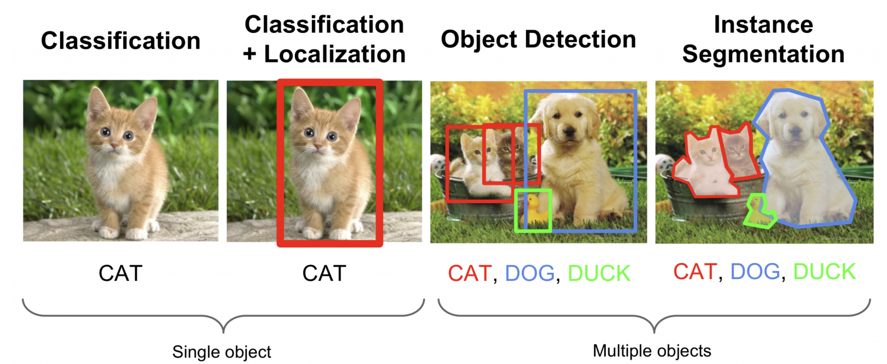
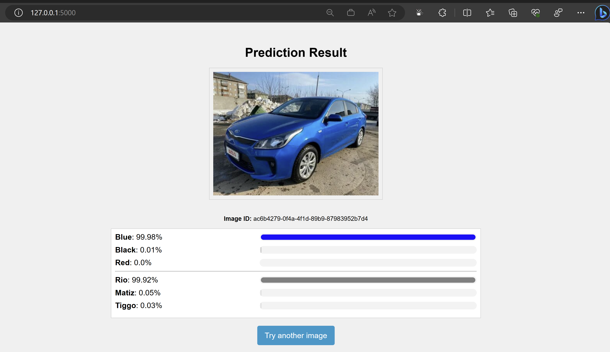

# MTT CoHack Challenge : Car Image Classification

## Introduction

In this challenge, we're diving into the whole process of creating an image classification app. You'll learn how to train and test an image classification model, plus we'll show you how to put that model into a simple web app using Flask.



## Requirements

- You will need to have **python** installed in your virtual environment, or computer.
- You will need to install the python libraries included in the *requirements.txt* file in the virtual environment or computer where you plan on developing the application using the following code.

```
pip install -r requirements.txt
```

- You will need an Azure subscription where you will be provisioning the services you will be using to train and test the model and as well as deploy the model.

## Learning Objectives

This hack will help you learn:

- You will learn to tag images using Azure AI services.
- You will delve into the world of model training and testing, all thanks to Azure AI services.
- You will discover the ropes of deploying that model into a straightforward web application.

## Success Criteria

### Challenge 1

- Create a project in Azure AI services to train your custom model for car classfication based on color.
- Train one model for classifying cars by color and test the model using the test images provided. The training data can be downloaded from [here](https://aistorage7nv29y3.blob.core.windows.net/car-images/car-color.zip).
- Train another model for classifying cars by the model and test the model using the test images provided. The training data can be downloaded from [here](https://aistorage7nv29y3.blob.core.windows.net/car-images/car-make.zip).
- Develop a simple web application to predict images using the models created in the azure service.

#### Resources

- [What is Azure AI Vision?](https://learn.microsoft.com/en-us/azure/ai-services/computer-vision/overview)
- [What is Vision Studio?](https://learn.microsoft.com/en-us/azure/ai-services/computer-vision/overview-vision-studio)
- [What is Custom Vision?](https://learn.microsoft.com/en-us/azure/ai-services/custom-vision-service/overview)
- [Test and retrain a model with Custom Vision Service](https://learn.microsoft.com/en-us/azure/ai-services/custom-vision-service/test-your-model)
- [Call the prediction API](https://learn.microsoft.com/en-us/azure/ai-services/custom-vision-service/use-prediction-api)
- [Custom Vision frequently asked questions](https://learn.microsoft.com/en-us/azure/ai-services/custom-vision-service/faq)
- [Create a virtual environment for your project](https://docs.python.org/3/library/venv.html)
- [Post HTTP Request using python requests function](https://www.w3schools.com/PYTHON/ref_requests_post.asp)




### [Optional] Challenge 2

- Train another model which classifies both the color label and the make label using one model.
- Deploy the flask application into Azure App service.

#### Resources

- [Quickstart: Deploy a Python (Django or Flask) web app to Azure App Service](https://learn.microsoft.com/en-us/azure/app-service/quickstart-python?tabs=flask%2Cwindows%2Cazure-cli%2Cvscode-deploy%2Cdeploy-instructions-azportal%2Cterminal-bash%2Cdeploy-instructions-zip-azcli)
